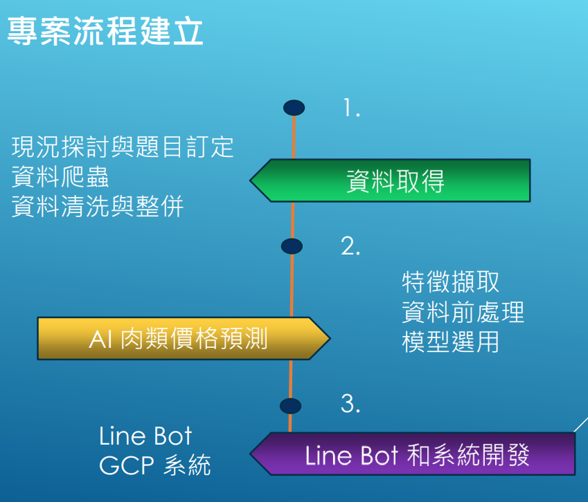
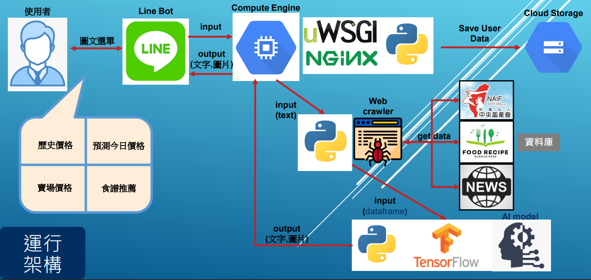

[ppt連結](https://drive.google.com/file/d/1PBjm1fxXA5WhFg68oUjSm3cfmure2RGL/view?usp=sharing)  
[報告影片連結](https://drive.google.com/file/d/1eIdOhQBxHINFajCm5RJVCAnCGrN_iXdr/view?usp=sharing)    
  
肉仔查查站
================
#### 組員：周禹宏、張立欣、蔡皓融、蘇冠融
一、問題描述
-----------
### 1. 肉類價格資訊來源眾多，需要多方查詢
### 2. 肉類價格相關訊息有一堆數字或文字描述
### 3. app對使用者的友善程度?
### 
二、現況分析
-----------
### 1. 網頁肉類資訊平台、網站眾多
### 2. 中盤商和零售價格沒有整合在同一網頁平台
### 3. 查詢需要另外安裝 app
### 4. app 只有查詢，沒有價格預測
### 5. app 文字描述預測，沒圖表，無法快速理解
### 6. app 肉類相關資訊偏少
###
三、目標
----------------

###
四、訓練模型
----------------

### Machine Learning - 
+ Linear regression
+ Lasso
+ Random Forest
+ adaBoost
### Deep Learning - 
+ LSTM
+ GRU
+ CNN
+ NLP 文本情感分析
###
五、平台架構
-----------

